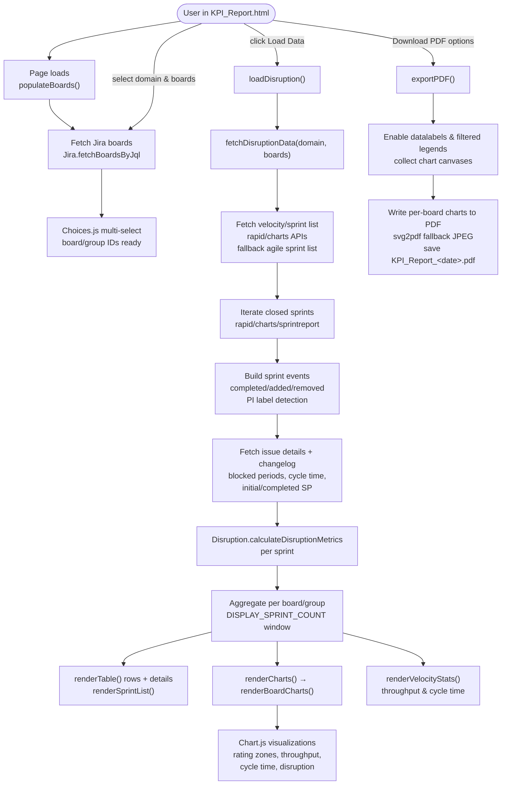

# KPI Report workflow (UML)

**Key interactions**
- **populateBoards()** fires on load and when the Jira domain changes, pulling available boards into a Choices.js multi-select. Board shortcuts (e.g., SCO, MCO, ACOSS) expand into predefined board ID groups.  
- **loadDisruption()** reads the selected boards, fetches sprint and issue data from Jira, calculates disruption metrics, and renders the metrics table, sprint chips, throughput/cycle stats, and all charts.  
- **exportPDF()** honors the “Include in PDF” toggles, temporarily turns on chart data labels, renders each chart to SVG (with JPEG fallback), and saves the combined report.  

This diagram reflects the workflow implemented in `KPI_Report.html`, including data acquisition, metric computation, visualization, and PDF export paths.
